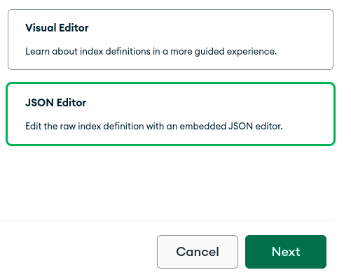
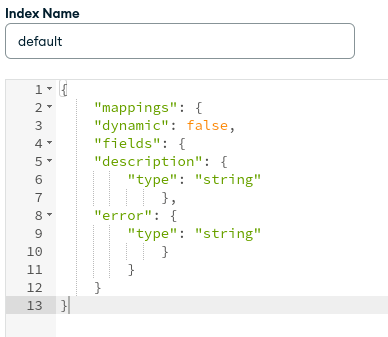

# What Error Bot
Simple telegram bot that can help you to search for telegram api errors and get information about them without leaving telegram


# Config
_config file can be found at: [config.ts](What/config.ts)_

- `bot_token` - Your telegram bot token
- `mongodb_url` - Your mongodb url (srv)
  - Export srv url for Node.js. It'll be something like this `mongodb+srv://<your_username>:<your_password_here>@<cluster_url>/?retryWrites=true&w=majority`
  - Replace `?retryWrites=true&w=majority` with `?authMechanism=SCRAM-SHA-1`. Now it'll be something like this `mongodb+srv://<your_username>:<your_password_here>@<cluster_url>/?authMechanism=SCRAM-SHA-1`


# Deploy
Deploying is easy af!

### Heroku


### Self-hosting
> _To run this bot, you need to install [deno](http://deno.land/) runtime in your system._

```bash
git clone https://github.com/Itz-fork/WhatErrorBot.git
cd WhatErrorBot
deno run --allow-net --allow-env What/bot.ts
```


# ToDo after deploy
After deploying the app, wait for it to run for the first time. In the first
run it'll add all errors to the `WhatErrorBot_DB` database collection.

### Create a search index
The search feature of this bot is depends entirely on the Mongodb atlas[^1] full text search feature (Based on apache lucene)

- Click on "Browse Collections"
  - 
- Navigate to search tab of the mongodb cluster
  - 
- Click on "CREATE INDEX" button
  - 
- Select "JSON Editor" and click on "Next" button
  - 
- Paste the following index definition to the json editor
  ```
  {
      "mappings": {
      "dynamic": false,
      "fields": {
      "description": {
          "type": "string"
              },
      "error": {
          "type": "string"
              }
          }
      }
  }
  ```
  - 
- Save and wait for the "Status" to change into "Active" state

Done!


# License
Licensed under [MIT](License)


[1] - This bot doesn't support on-premises text search.